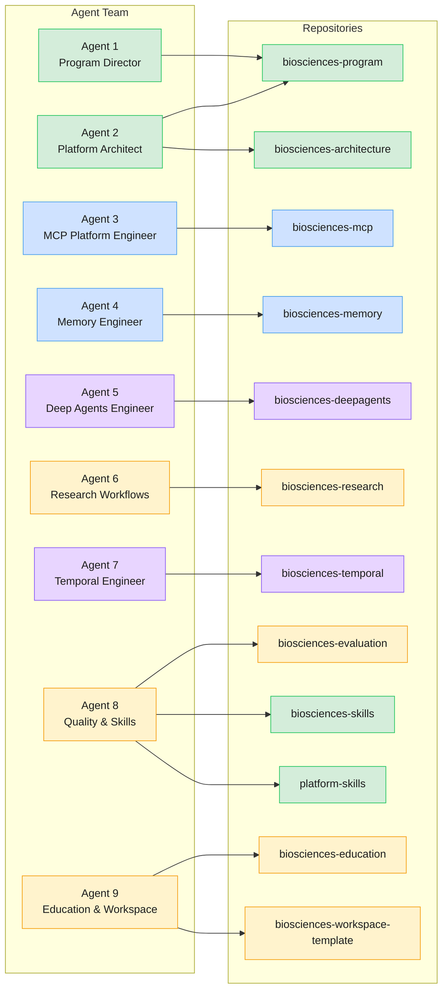

# Agent Ownership Map

> Maps each of the 9 agents in the Open Biosciences platform to the repositories they own
> and their primary responsibilities. Color-coded by migration wave.

## Agent Responsibilities

| # | Agent | Repos | Key Responsibility |
|---|-------|-------|-------------------|
| 1 | Program Director | biosciences-program | Cross-repo coordination, migration tracking |
| 2 | Platform Architect | biosciences-architecture, biosciences-program | ADR authoring (via program repo), schema stewardship, Fuzzy-to-Fact protocol |
| 3 | MCP Platform Engineer | biosciences-mcp | 12 FastMCP servers, unified gateway, 697+ tests |
| 4 | Memory Engineer | biosciences-memory | Graphiti/Neo4j knowledge graph, dual-environment management |
| 5 | Deep Agents Engineer | biosciences-deepagents | LangGraph supervisor + 7 specialist subagents, React UI |
| 6 | Research Workflows | biosciences-research | Competency questions catalog, graph-builder workflows |
| 7 | Temporal Engineer | biosciences-temporal | PydanticAI + Temporal.io durable workflows |
| 8 | Quality & Skills | biosciences-evaluation, biosciences-skills, platform-skills | Evaluation rubrics, 6 domain skills, scaffold commands |
| 9 | Education & Workspace | biosciences-education, biosciences-workspace-template | Training materials, tutorials, bootstrap scripts |

## Decision Authority

| Decision Type | Authority |
|---------------|-----------|
| Schema changes | Platform Architect (Agent 2) |
| New MCP server | MCP Platform Engineer (Agent 3) + Platform Architect (Agent 2) |
| Cross-repo dependencies | Program Director (Agent 1) |
| Test quality standards | Quality & Skills Engineer (Agent 8) |
| Migration wave execution | Program Director (Agent 1) |
