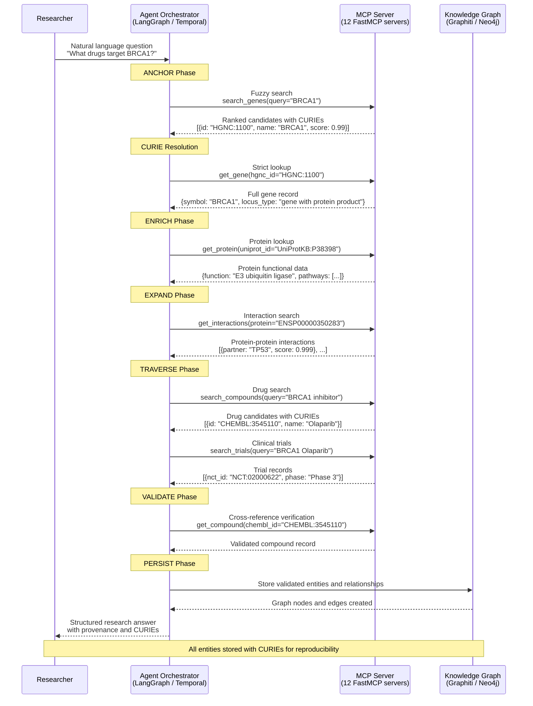

# Fuzzy-to-Fact Data Flow

> Sequence diagram showing how a research question flows through the Open Biosciences platform,
> from natural language input to validated knowledge graph output. This is the core data pattern
> defined in ADR-001 Section 3.

## Protocol Summary

The **Fuzzy-to-Fact protocol** (ADR-001 Section 3) enforces a bi-modal workflow across all 12 MCP servers:

| Phase | Mode | Input | Output | Error on Violation |
|-------|------|-------|--------|-------------------|
| Discovery | Fuzzy | Natural language string | Ranked candidates with CURIEs and confidence scores | -- |
| Resolution | Strict | Resolved CURIE (e.g., `HGNC:1100`) | Full canonical record | `UNRESOLVED_ENTITY` |

## Orchestration Phases

The agent orchestrator (LangGraph supervisor or Temporal workflow) coordinates 6 phases:

| Phase | Purpose | MCP Servers Used |
|-------|---------|-----------------|
| **ANCHOR** | Resolve gene symbols to canonical identifiers | HGNC, Entrez, Ensembl |
| **ENRICH** | Get protein functional context | UniProt |
| **EXPAND** | Find protein-protein and genetic interactions | STRING, BioGRID |
| **TRAVERSE** | Search drugs and clinical trials | ChEMBL, PubChem, IUPHAR, ClinicalTrials, WikiPathways |
| **VALIDATE** | Cross-check claims against source databases | All servers (verification queries) |
| **PERSIST** | Store validated knowledge graph | Graphiti / Neo4j |
