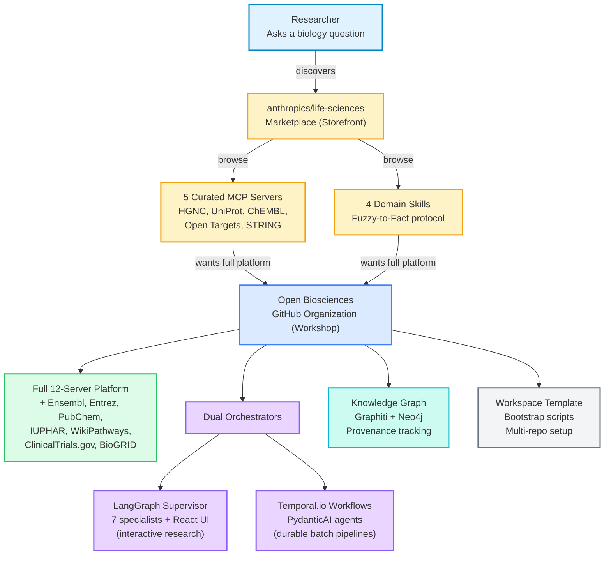
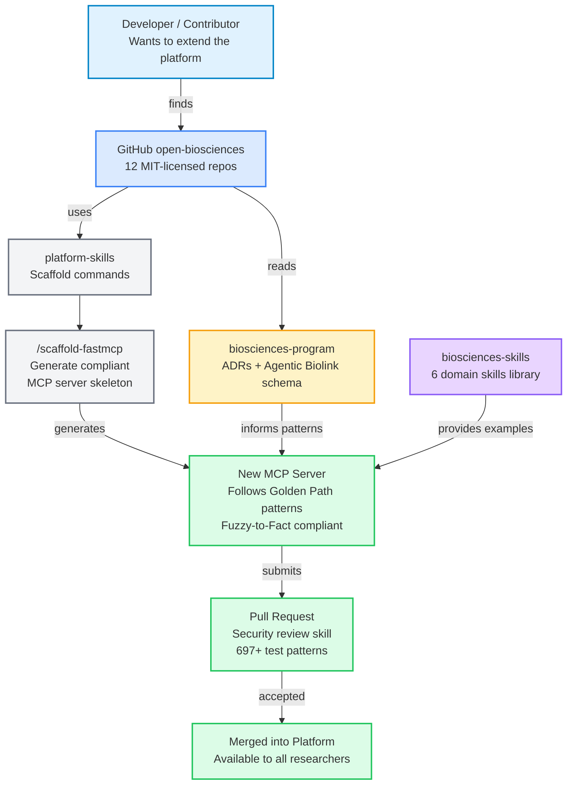

# Ecosystem Positioning: From Storefront to Workshop

How researchers and developers discover and engage with the Open Biosciences platform.
The marketplace provides a curated **storefront** (5 MCP servers, 4 skills), while
the GitHub organization provides the full **workshop** (12 MCP servers, 6 domain skills,
dual orchestrators, knowledge graph, workspace template).

## Researcher Journey

## Developer / Contributor Journey

