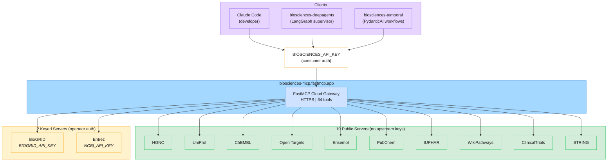

# FastMCP Cloud Gateway Architecture

> Unified HTTPS gateway serving 12 MCP servers (34 tools) to all platform clients.
> Two-tier auth model: consumer-facing API key + operator-managed upstream keys.



## Two-Tier Auth Model

| Tier | Key | Owner | Location | Purpose |
|------|-----|-------|----------|---------|
| **Consumer** | `BIOSCIENCES_API_KEY` | Plugin consumer | Client `.env` (referenced as `${BIOSCIENCES_API_KEY}` in `.mcp.json` headers) | Authenticates to FastMCP Cloud gateway |
| **Operator** | `BIOGRID_API_KEY` | Platform operator | FastMCP Cloud server environment | BioGRID upstream API auth |
| **Operator** | `NCBI_API_KEY` | Platform operator | FastMCP Cloud server environment | Entrez rate limit upgrade (3 to 10 req/s) |

10 of the 12 upstream life sciences APIs are fully public and require no authentication keys.

## Gateway Details

| Property | Value |
|----------|-------|
| Endpoint | `https://biosciences-mcp.fastmcp.app/mcp` |
| Transport | HTTPS (Streamable HTTP) |
| Servers | 12 FastMCP servers |
| Tools | 34 total (see [mcp-server-tiers.md](mcp-server-tiers.md)) |
| Tests | 697+ (in biosciences-mcp repo) |
| Protocol | Fuzzy-to-Fact (ADR-001 Section 3) |

## Client Configuration

All clients connect via `.mcp.json` with the same pattern:

```json
{
  "mcpServers": {
    "biosciences-mcp": {
      "type": "http",
      "url": "https://biosciences-mcp.fastmcp.app/mcp",
      "headers": {
        "Authorization": "Bearer ${BIOSCIENCES_API_KEY}"
      }
    }
  }
}
```

## References

- [ADR-001: Agentic-First Architecture](../../docs/adr/accepted/adr-001-v1.4.md) -- Fuzzy-to-Fact protocol
- [ADR-004: FastMCP Lifecycle Management](../../docs/adr/accepted/adr-004-v1.0.md) -- Server lifecycle and deployment
- [mcp-server-tiers.md](mcp-server-tiers.md) -- Full server/tool inventory
