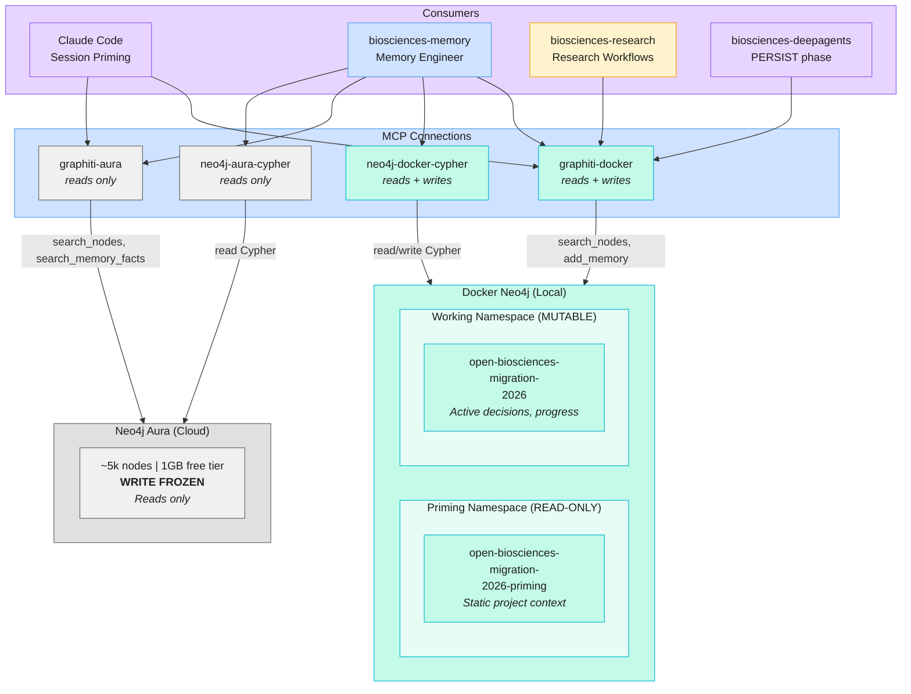

# Graphiti / Neo4j Dual-Environment Topology

> The Open Biosciences knowledge graph runs across two Neo4j environments with
> distinct read/write policies. All new writes go to Docker; Aura is read-only (write-frozen).



## Namespace Policy

| Namespace | Environment | Group ID | Mutable? | Purpose |
|-----------|-------------|----------|----------|---------|
| Priming | Docker | `open-biosciences-migration-2026-priming` | **NO -- read-only, never update** | Static project context for session priming |
| Working | Docker | `open-biosciences-migration-2026` | Yes | Active decisions, progress, evolving context |
| Aura (all) | Cloud | N/A | **NO -- write-frozen** | Historical data; reads for analytics only |

## MCP Connection Matrix

| MCP Server | Environment | Read | Write | Primary Use |
|------------|-------------|------|-------|-------------|
| `graphiti-docker` | Docker Neo4j | Yes | Yes | Session priming, memory storage, knowledge persistence |
| `graphiti-aura` | Neo4j Aura | Yes | **No** | Historical searches, analytics, cross-referencing |
| `neo4j-docker-cypher` | Docker Neo4j | Yes | Yes | Direct Cypher queries, schema inspection |
| `neo4j-aura-cypher` | Neo4j Aura | Yes | **No** | Direct Cypher analytics queries |

## Write-Freeze Policy (Aura)

Neo4j Aura (`graphiti-aura`) is in a **permanent write-freeze state**:

- The free-tier 1GB instance is at capacity (~5k nodes)
- This is a known, accepted state -- do NOT warn about capacity or recommend upgrading
- **NEVER write new data to graphiti-aura** -- no `add_memory`, no `write_neo4j_cypher`
- **Reads from Aura are fine** -- searches, queries, analytics all permitted
- **All new data MUST go to graphiti-docker** (local Docker Neo4j)

## Session Priming Protocol

Every Claude Code session must begin by querying the priming namespace:

```python
# REQUIRED at session start
search_nodes(query="project structure", group_ids=["open-biosciences-migration-2026-priming"])
search_memory_facts(query="agent ownership and dependencies", group_ids=["open-biosciences-migration-2026-priming"])
```

This loads the 9-agent team structure, repo dependencies, migration status, and platform conventions into the session context.
