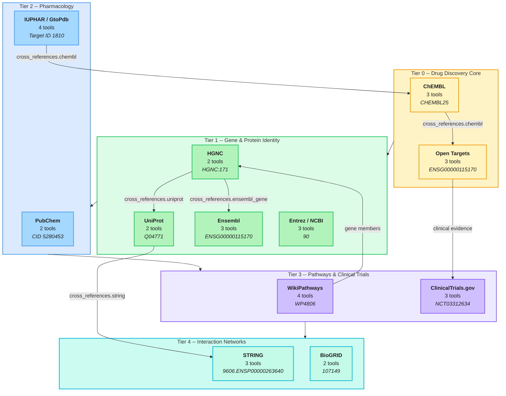

# MCP Server Tiers: 12 Databases, 34 Tools

The Open Biosciences platform provides unified access to 12 life sciences databases
organized in 5 tiers, from drug discovery core to interaction networks. Each server
implements the Fuzzy-to-Fact protocol (ADR-001) with `search_*` (fuzzy) and `get_*`
(strict CURIE) tool pairs.



## Server Details

| Tier | Server | Tools | Fuzzy Input | Strict CURIE Format | Key Data |
|------|--------|-------|-------------|---------------------|----------|
| 0 | ChEMBL | `search_compounds`, `get_compound`, `get_compounds_batch` | Drug/compound name | `CHEMBL25` | Drug compounds, assays, mechanisms |
| 0 | Open Targets | `search_targets`, `get_target`, `get_associations` | Gene/disease name | `ENSG00000115170` | Disease-target associations, clinical evidence |
| 1 | HGNC | `search_genes`, `get_gene` | Gene symbol/name | `HGNC:171` | Official gene nomenclature, cross-references |
| 1 | UniProt | `search_proteins`, `get_protein` | Protein name/gene | `Q04771` | Protein sequences, function, structure |
| 1 | Ensembl | `search_genes`, `get_gene`, `get_transcript` | Gene symbol | `ENSG00000115170` | Genomic coordinates, transcripts, variants |
| 1 | Entrez | `search_genes`, `get_gene`, `get_pubmed_links` | Gene symbol/keyword | `90` (NCBI Gene ID) | Gene records, literature links |
| 2 | PubChem | `search_compounds`, `get_compound` | Compound name/SMILES | `CID 5280453` | Chemical structures, bioactivity |
| 2 | IUPHAR/GtoPdb | `search_ligands`, `get_ligand`, `search_targets`, `get_target` | Drug/receptor name | Target ID `1810` | Pharmacological targets, ligand binding |
| 3 | WikiPathways | `search_pathways`, `get_pathway`, `get_pathways_for_gene`, `get_pathway_components` | Pathway/gene name | `WP4806` | Biological pathways, gene members |
| 3 | ClinicalTrials.gov | `search_trials`, `get_trial`, `get_trial_locations` | Condition/drug/NCT ID | `NCT03312634` | Clinical studies, enrollment, outcomes |
| 4 | STRING | `search_proteins`, `get_interactions`, `get_network_image_url` | Protein/gene name | `9606.ENSP00000263640` | Protein-protein interactions, confidence scores |
| 4 | BioGRID | `search_genes`, `get_interactions` | Gene symbol | `107149` | Genetic and physical interactions |

## Cross-Reference Flow

Every entity returned by any MCP server includes a `cross_references` object (ADR-001 Appendix A)
that enables automated graph traversal across databases:

```
HGNC:171 (ACVR1)
  cross_references:
    uniprot: ["Q04771"]
    ensembl_gene: "ENSG00000115170"
    entrez: "90"
    string: "9606.ENSP00000263640"
```

This enables the platform to resolve a single gene name into a fully connected
knowledge graph spanning all 12 databases without manual identifier mapping.
