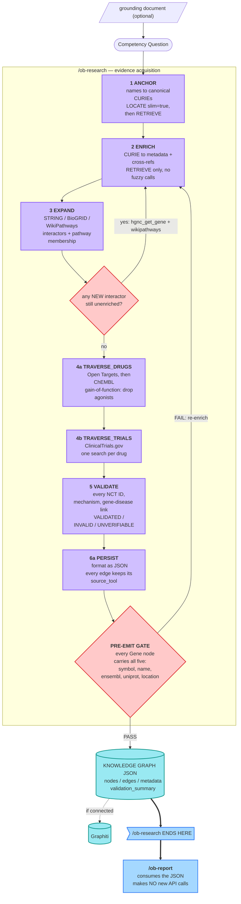
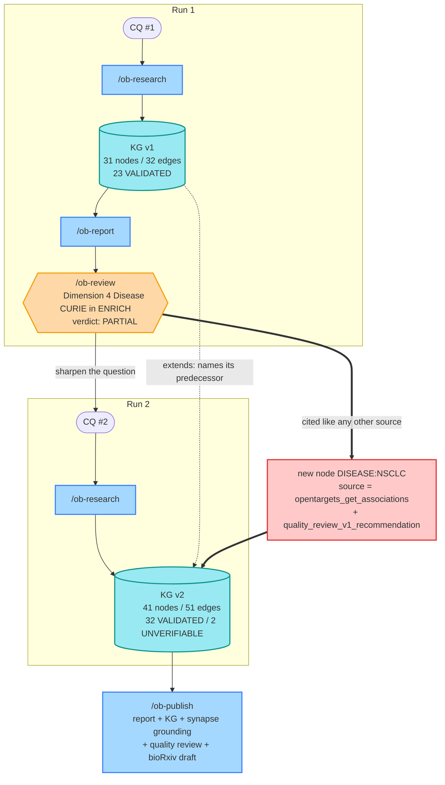

# /ob-research — The Graph-Build Path (Phases 1–6a)

> What happens *before* the report exists.
>
> Diagrams are Mermaid, and both were rendered and validated rather than
> hand-drawn — [A](https://l.mermaid.ai/ZGAZ05) · [B](https://l.mermaid.ai/j8aaMY)
> (open/edit links).
>
> Worked example: `biosciences-workspace-template/output/sl-system-approach/`
> (S′/ΔS′ synthetic-lethality in lung cancer, 3 knowledge graphs across 2 CQs).
> Phase detail cross-checked against `output/cq14/` and `output/cq14edgefix/`.
>
> **See also:** [data-flow.md](data-flow.md) (abstract, BRCA1) ·
> [research-workflow-sequence.md](research-workflow-sequence.md) (deepagents
> supervisor topology, ACVR1/FOP). Neither of those draws the enrichment loop,
> the pre-emit gate, or the 6a→6b boundary — which is why this one exists.
>
> The prior visual of this pipeline,
> `biosciences-workspace-template/output/cq14/open-biosciences-cq14-workflow.excalidraw`,
> uses an ad-hoc 5-phase vocabulary (ANCHOR / VALIDATE / DRUGGABILITY /
> CLINICAL / DISEASE) that does not match the canonical phases below. Prefer
> this document.

---

## A. The linear path — one run

Two mechanisms carry the weight, and neither appears in any other diagram in
this directory:

- **The Phase 3 loop** (`biosciences-graph-builder/SKILL.md:352`, marked
  CRITICAL). Every interactor STRING or BioGRID returns is a new graph node that
  has never been through ENRICH. The phase is not allowed to exit until each one
  has had `hgnc_get_gene` + WikiPathways run against it. Draw EXPAND as a single
  forward step and you have drawn a pipeline that produces half-populated nodes.
- **The Phase 6a pre-emit gate** (`SKILL.md:493`). Nothing emits until every
  Gene node carries all five of symbol, name, ensembl, uniprot, location.

**The boundary is the point.** Everything inside the subgraph is evidence
acquisition. Everything after it is synthesis over a frozen artifact — `/ob-report`
makes no API calls. So a report defect is always one of exactly two things: a
graph that was built wrong, or a synthesis that misread a graph that was right.
The JSON tells you which.

Validation counts from the two `sl-system-approach` runs: v1 scored 23
VALIDATED / 0 INVALID / 0 UNVERIFIABLE; v2 scored 32 / 0 / 2.

---

## B. The outer loop — how runs compound

Three properties make this incremental rather than merely repeated:

1. **`extends`** — a run names its predecessor. Graphs accrete; they don't reset.
2. **Review findings re-enter as provenance.** The `quality_review_v1_recommendation`
   string sits in the new node's `source` field *next to the API call*. The
   critique is cited like any other source.
3. **The review is comparative.** The CQ #2 review has sections "Changes from
   Prior Review" and "Comparison to CQ #1". Drift is visible.

### Where these came from

The three mechanisms above did not arrive at once. The public run outputs record
three distinct generations, and the ordering is the useful part:

| Stage | Runs | Mechanism | Result |
|---|---|---|---|
| 1 | `qw` → `qw3` → `qw4` | none | same question, six JSON schemas, node counts 7 → 12 → 5, no `extends` anywhere. Every run re-derived from scratch. |
| 2 | `cq14` → `cq14edgefix` | `WORKSPACE_MEMORY.md` + a chronology, in markdown | learnings survive, but a *person* applies them |
| 3 | `sl-system-approach` | `extends` + review-as-provenance, inside the JSON | v1 → v2 is machine-traceable |

Stage 2 is nearly free and catches most of the repeated pain — the cq14
`WORKSPACE_MEMORY.md` carries root-caused gaps, a `slim=true` discipline rule,
and open issues (an unreachable API, an auth failure) that would otherwise be
rediscovered every session. Stage 3 is the structural fix.

The single most transferable idea is in `cq14edgefix/tp53-sl-pipeline-chronology.md`:
separate **protocol gaps** (the run never made the call) from **presentation
gaps** (it did, but the report failed to cite it). Several of that run's PARTIAL
dimension scores were presentation gaps — re-running the pipeline to fix those
would have been wasted effort.

---

## C. Porting the shape to psychology-research

`psychology-evidence-builder` runs LOCATE → RETRIEVE → EXTRACT → CLASSIFY →
SYNTHESIZE. Lined up against the bio phases:

| bio phase | psychology stage | state |
|---|---|---|
| 1 ANCHOR | 1 LOCATE + 2 RETRIEVE | same shape — fuzzy query, then resolved source |
| 2 ENRICH | 3 EXTRACT | same shape — decorate the retrieved record |
| 3 EXPAND | — | absent: no citation-graph walk, so no secondary-enrichment loop |
| 5 VALIDATE | 4 CLASSIFY | **stronger than bio** — five labels (VERIFIED / SELF_REPORTED / SUPPORTED / UNRESOLVED / CONFLICTING) vs three |
| 6a PERSIST | — | the skill presents the packet; it does not require writing it |
| pre-emit gate | 9 validators in `scripts/validators/` | **present, but guarding the report** rather than the packet |
| 6b REPORT | 5 SYNTHESIZE + `/psy-report` | same shape |

The gate machinery is not missing — psychology has more of it than bio does,
including a load-bearing rule bio has no equivalent for (a graph-sourced fact is
`local_context` and can never be `VERIFIED`). What is missing is that nothing
**carries forward**: claims have no `id`, so no packet, review, or diff can refer
to a specific claim, and there is no `extends`.

Design proposal: [`../plans/2026-09-13-psychology-iterative-research-loop.md`](../plans/2026-09-13-psychology-iterative-research-loop.md)

---

## Sources

- `open-biosciences-plugins/bio-research/commands/ob-research.md` — phase ladder
- `open-biosciences-plugins/bio-research/skills/biosciences-graph-builder/SKILL.md`
  — `:352` secondary enrichment, `:493` pre-emit validation
- `open-biosciences-plugins/bio-research/references/fuzzy-to-fact.md` — bi-modal contract
- `biosciences-workspace-template/output/` — every count in this document
