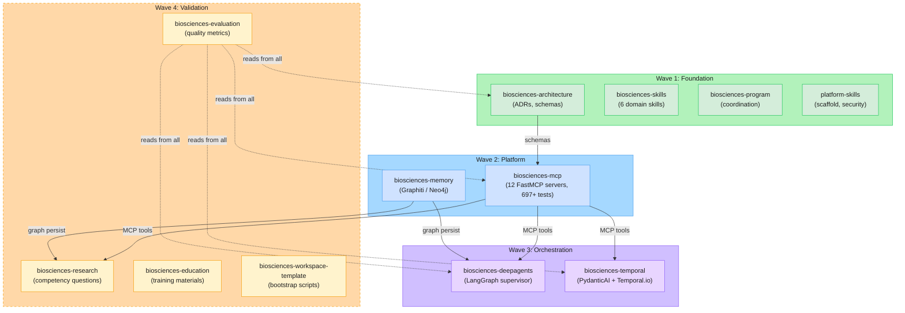

# Repository Dependency Graph

> Visual map of how the 12 Open Biosciences repositories depend on each other.
> Arrows point from provider to consumer (A --> B means "B depends on A").

## Dependency Rules

| Rule | Description |
|------|-------------|
| **Pure providers** | `biosciences-architecture` and `biosciences-skills` have no upstream dependencies |
| **Schema dependency** | `biosciences-mcp` depends on `biosciences-architecture` for Pydantic schemas and ADR compliance |
| **Tool consumers** | `biosciences-deepagents` and `biosciences-temporal` consume MCP tools via HTTP transport |
| **Graph persistence** | `biosciences-memory` is consumed by `biosciences-research` and `biosciences-deepagents` (PERSIST phase) |
| **Quality observer** | `biosciences-evaluation` reads from all repos but no repo depends on it |
