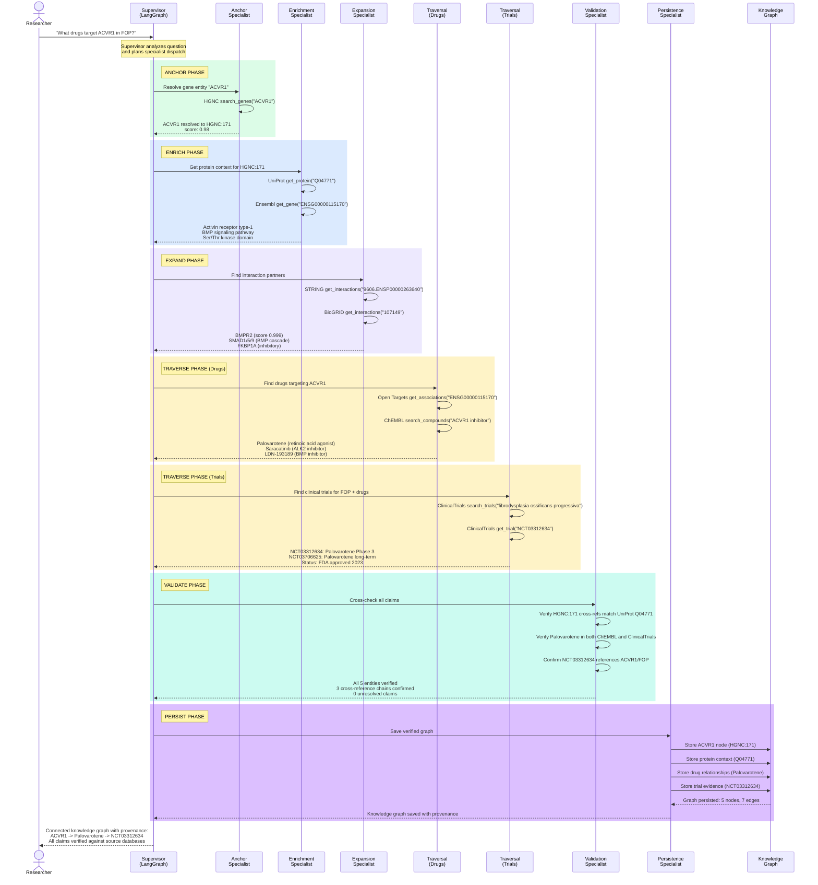

# Research Workflow: ACVR1/FOP Drug Discovery Journey

A complete research question flow showing how the Open Biosciences platform
transforms a natural language question into a verified knowledge graph. This
example traces the ACVR1/FOP (fibrodysplasia ossificans progressiva) drug
discovery scenario through all 7 specialist subagents.

## Phase Summary

| Phase | Specialist | MCP Servers Used | Key Output |
|-------|-----------|-----------------|------------|
| ANCHOR | Anchor Specialist | HGNC | ACVR1 resolved to HGNC:171 (canonical CURIE) |
| ENRICH | Enrichment Specialist | UniProt, Ensembl | Protein function: activin receptor type-1, BMP signaling |
| EXPAND | Expansion Specialist | STRING, BioGRID | Interaction partners: BMPR2, SMAD1/5/9, FKBP1A |
| TRAVERSE (Drugs) | Traversal Specialist | Open Targets, ChEMBL | Drugs: Palovarotene, Saracatinib, LDN-193189 |
| TRAVERSE (Trials) | Traversal Specialist | ClinicalTrials.gov | Trials: NCT03312634 (Phase 3), NCT03706625 (long-term) |
| VALIDATE | Validation Specialist | All (cross-check) | 5 entities verified, 3 cross-reference chains confirmed |
| PERSIST | Persistence Specialist | Neo4j/Graphiti | 5 nodes, 7 edges saved with full provenance |

## Biological Context

**ACVR1** (Activin A Receptor Type 1, also known as ALK2) is a bone morphogenetic protein
(BMP) type I receptor. Gain-of-function mutations in ACVR1 (most commonly R206H) cause
**Fibrodysplasia Ossificans Progressiva (FOP)**, an ultra-rare disorder where soft tissue
progressively turns to bone.

**Palovarotene** is a retinoic acid receptor gamma (RAR-gamma) agonist that inhibits
aberrant BMP signaling. It received FDA approval in 2023 (brand name: Sohonos) as the
first treatment specifically for FOP, based on results from clinical trial NCT03312634.

This research workflow demonstrates how the platform can trace the complete path from
gene identity through protein function, interaction networks, drug candidates, and
clinical evidence -- producing a verified knowledge graph with every claim backed by
an authoritative database source.
