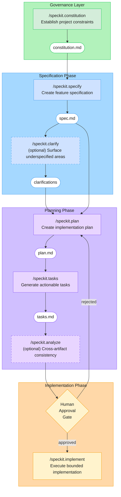

# SpecKit SDLC Workflow

> The 7-step specification-driven development lifecycle defined in ADR-003.
> Each step produces a traceable artifact before code is written.
> Commands live in `biosciences-program/.claude/commands/speckit.*.md`.

## Commands

| # | Command | Input | Output | Gate |
|---|---------|-------|--------|------|
| 1 | `/speckit.constitution` | Project principles, ADR constraints | `constitution.md` | **Required for new projects** |
| 2 | `/speckit.specify` | Feature request (natural language) | `spec.md` | -- |
| 3 | `/speckit.clarify` | `spec.md` (auto-triggered) | 5 targeted questions + user answers | Optional |
| 4 | `/speckit.plan` | `spec.md` + `constitution.md` | `plan.md` with architecture decisions | -- |
| 5 | `/speckit.tasks` | `plan.md` | `tasks.md` with dependency order | -- |
| 6 | `/speckit.analyze` | All artifacts | Consistency + Constitution compliance report | **Blocks on violations** |
| 7 | `/speckit.implement` | `tasks.md` + human approval | Code changes (delegates to Platform Skills) | **Human approval required** |

## Key Principles

- **Specification before code**: Every feature flows through structured artifacts before implementation begins
- **Bounded agent design**: `max_tasks_per_session: 5` prevents PR sprawl (ADR-003 Section 4.1)
- **Platform Skill chaining**: `/speckit.implement` delegates to scaffold commands (ADR-002) before writing code directly
- **Single writer ownership**: Each artifact has exactly one owning command (ADR-003 Section 4.2)

## References

- [ADR-003: SpecKit Specification-Driven Development](../../docs/adr/accepted/adr-003-v1.0.md)
- [ADR-002: Project Skills as Platform Engineering](../../docs/adr/accepted/adr-002-v1.0.md)
- SpecKit commands: `biosciences-program/.claude/commands/speckit.*.md`
