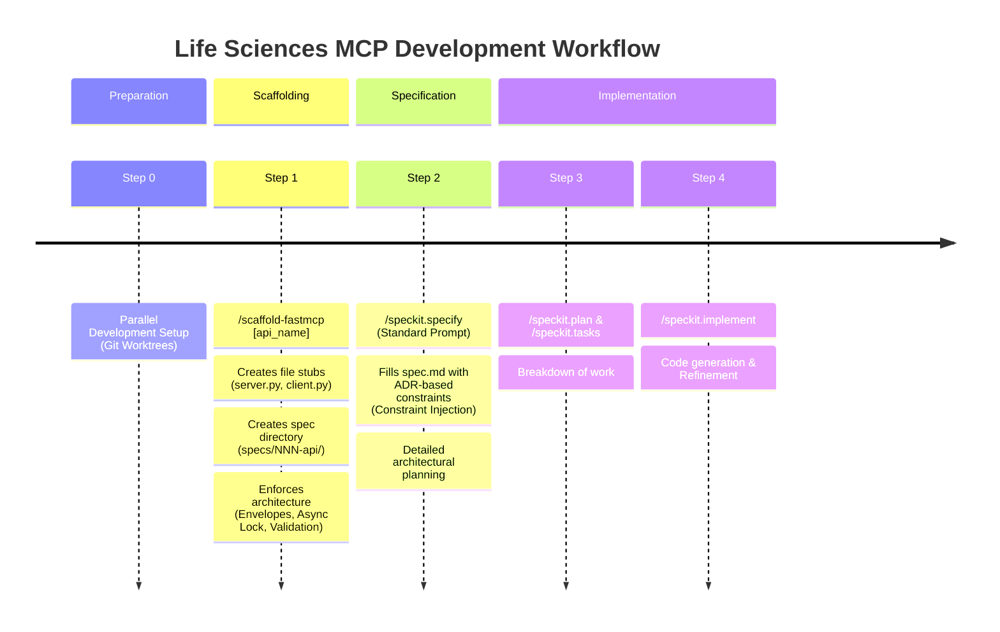
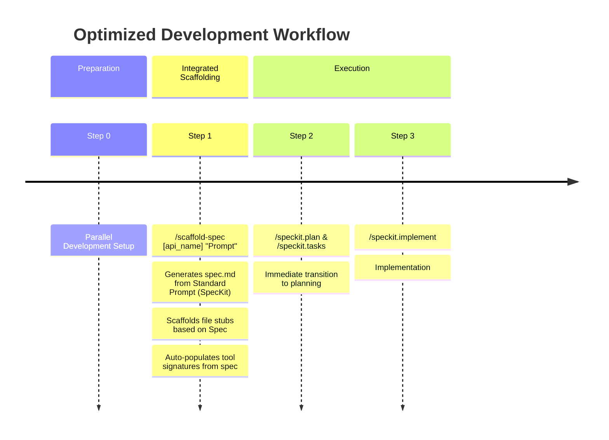

# Life Sciences MCP Standardization Process Timeline

This document visualizes the current and potential optimized workflows for the `scaffold-fastmcp` process within the Life Sciences MCP development lifecycle.

## Current Workflow

The current process front-loads the scaffolding before specification. This ensures the directory structure exists before the agent attempts to write specifications or code, but it leaves the generated specification files empty, requiring a separate `/speckit.specify` step.

## Optimized Workflow (Future State)

A potential optimization is to merge the Scaffolding and Specification steps. Since the Standard Prompt contains structured requirements, `scaffold-fastmcp` could accept a specification file or prompt as input and pre-populate the `spec.md` and even generated code stubs with more specific details (e.g., exact tool names inferred from the spec).

## Analysis

- **Current State Efficiency:** High. The strict separation prevents "blank page syndrome" by ensuring the agent always has a file structure to query and populate.
- **Optimization Value:** Moderate. Merging steps saves one user interaction but complicates the scaffolding logic, which would need to parse natural language specifications. The current "Template -> Fill" pattern is robust and deterministic.
